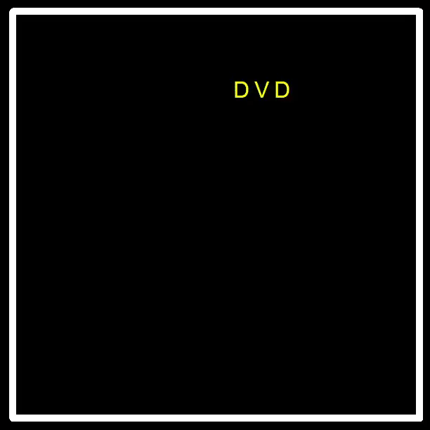

In the world of data analysis and statistical modeling, R is a powerful tool. It's widely used for tasks like data visualization, machine learning, and statistical analysis. But what if you wanted to step out of the conventional uses of R and embark on a creative adventure? That's precisely what I did during my spare time while taking a course at the Karlsruhe Institute of Technology (KIT) on "Modeling and Analyzing Consumer Behavior with R." In this blog post, I'll introduce you to a project I affectionately call the "bouncing-dvd-simulator."

## The Nostalgic Inspiration

Do you remember those old DVD players with a screensaver that involved a DVD logo bouncing around the screen, seemingly never hitting the edges? It was a simple yet mesmerizing sight, and it used to keep us entertained as we waited for our favorite movie to start. This screensaver is not only nostalgic but also quite iconic.


I couldn't help but wonder if I could replicate this screensaver in R, a language primarily designed for data science and statistical analysis. The idea seemed a bit absurd, but I was determined to give it a try. After all, one of the great things about programming is that it allows you to experiment and create things outside of your normal domain.

## The Bouncing-DVD-Simulator Project

I started by creating a new R script, setting up the environment, and defining the essential parameters for the project. I used an external window to display the screensaver and created a field where the DVD logo would bounce.

```R
## External window
x11()
par(mar = c(1, 1, 1, 1), bg = "black")

## setup field
plot.new()
plot.window(xlim = c(0,100), ylim = c(0,100))
# draw borders
lines(c(0, 0, 100, 100, 0), c(0, 100, 100, 0, 0), type = "l", lwd = 10, col = "white")


# field boundaries
xmin <- 2.5
xmax <- 88
ymin <- 2.5
ymax <- 95.5

## place init
x <- 50
y <- 50

## Set direction
dx <- runif(1, 1, 2)
dy <- runif(1, 1, 2)

## colorcode
color <- "purple"
chooseColor = function(){
  xRand <- sample(1:8)
  if(xRand == 1) colorRand = "purple"
  if(xRand == 2) colorRand = "blue"
  if(xRand == 3) colorRand = "orange"
  if(xRand == 4) colorRand = "green"
  if(xRand == 5) colorRand = "white"
  if(xRand == 6) colorRand = "red"
  if(xRand == 7) colorRand = "yellow"
  if(xRand == 8) colorRand = "lightblue"
  return (colorRand)
}
while(1) {
  Sys.sleep(.1)
  
  points(x+5, y, pch = 15, col = "black", cex = 11)
  
  # Move logo
  x <- x + dx
  y <- y + dy
  
  # Collision detection
  if (x > xmax | x < xmin) {
    if (x < xmin) x <- xmin
    if (x > xmax) x <- xmax
    dx <- -dx * runif(1, .9, 1.1)
    color = chooseColor()
  }
  if (y < ymin | y > ymax) {
    if (y < ymin) y <- ymin
    if (y > ymax) y <- ymax
    dy <- -dy * runif(1, .9, 1.1)
    color = chooseColor()
  }
  
  # Draw logo
  points(x, y, pch = 'D', col = color, cex = 2)
  points(x+5, y, pch = 'V', col = color, cex = 2)
  points(x+10, y, pch = 'D', col = color, cex = 2)
  
  # Draw borders
  lines(c(0, 0, 100, 100, 0), c(0, 100, 100, 0, 0), type = "l", lwd = 10, col = "white")
  
}
```

The code creates a black background window, sets up the field boundaries, and initializes the DVD logo's position, direction, and color. Then, it enters a loop where the logo moves, bounces off the edges, and changes color. The loop runs infinitely, just like the screensaver we remember.

But why did I choose R for this project? The answer is simple: because it's unconventional. R is not the first choice for creating games or animations, but that's precisely what made this project so interesting. It allowed me to challenge the boundaries of what R can do and gave me a different perspective on the language.






## Conclusion

Sometimes, the most satisfying projects arise from the unlikeliest of ideas. The "bouncing-dvd-simulator" project was a fun and nostalgic experiment that showed me the versatility of R beyond its typical data analysis and modeling roles. It reminded me that creativity knows no boundaries, and programming can be an excellent medium for expressing it.

So, if you ever find yourself with a quirky idea, don't be afraid to give it a shot, even if it means stretching the limits of your favorite programming language. You might just create something unexpectedly delightful.

Now, excuse me while I watch the bouncing DVD logo on my R-powered screensaver.