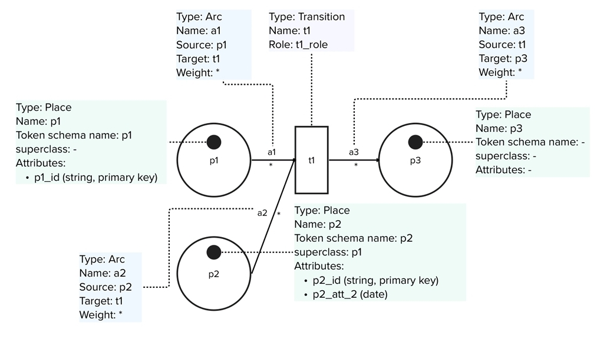
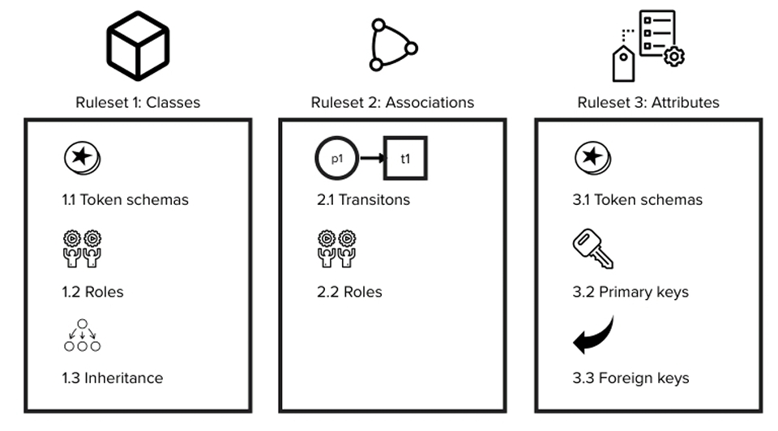

## Introduction

Hello everyone, I'm David Diener, and I recently completed my Master's thesis at the Karlsruher Institute of Technology, specifically at the Institute of Applied Informatics and Formal Description Methods (AIFB). My research focuses on an approach to automating the extraction of data models from business process models. I'm excited to share some key insights here.

## Industry Collaboration with Mercedes-Benz

The prototype application for this research was developed in close collaboration with Mercedes-Benz in Jacksonville, Florida. This partnership provided invaluable industry insights and allowed us to fine-tune the application to meet real-world challenges, making it an excellent example of academia-industry collaboration.

## The Challenge

In the early phases of software development, two critical tasks often come into play: business process modeling and data modeling. Traditionally, these tasks have been carried out independently, leading to inefficiencies and increased project timelines. My research aims to eliminate these bottlenecks by seamlessly integrating these two crucial areas.

## My Solution: Introducing XML-Data-Nets

To address this challenge, I introduced a novel variant of High-Level Petri Nets, termed XML-Data-Nets. This extension enables the representation of more complex relationships and objects, making data model extraction more accurate and efficient. 

**Example of a basic XDN model**

I also formulated three rulesets to guide the extraction of classes, associations, and attributes, culminating in a logical UML Class Diagram that serves as a robust foundation for software development.

**Overview of the three rulesets for the extraction of a Conceptual Data Model from a Business Process Model**

## The Prototype Application: Data Model Extractor

The prototype application, developed as part of this research, serves as a compelling proof-of-concept. It underwent rigorous evaluations, both quantitative and qualitative, and the results were promising. The application demonstrated significant time and resource savings while maintaining high levels of accuracy, making it a viable solution for modern software development challenges. Feel free to try out the Data Model Extractor yourself.



## Why This Research Matters

The implications of this work are far-reaching and highly relevant to both academia and industry. By automating the extraction process, we can significantly streamline the design phase of software development, leading to faster project completion and reduced costs. This is not just a theoretical concept; it has practical, real-world applications that can transform how we approach software projects. 

While the initial results are promising, there's some room for further research and development. I'm eager to continue this work and explore opportunities for integrating this methodology into existing software development workflows.

## Conclusion and PDF Link

Thank you for taking the time to delve into my research. I'm confident that this work represents a significant advancement in the field and has the potential to benefit various stakeholders, including potential employers looking for innovative problem-solving skills. For a more in-depth look, you can access my full thesis below.



Feel free to reach out for any questions, collaborations, or opportunities. I'm always open to engaging in meaningful dialogues that push the boundaries of what's possible in software development.