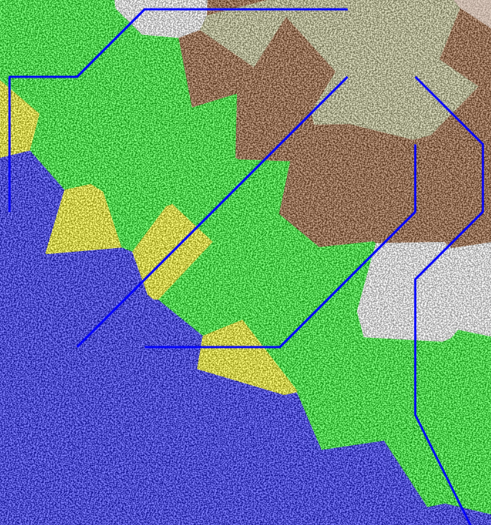
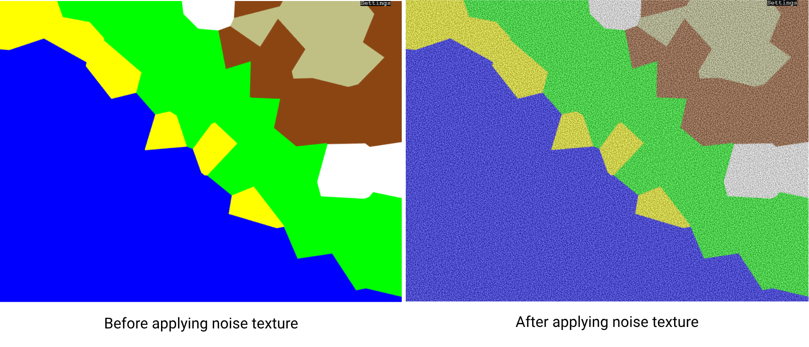

Creating the perfect map for a fantasy world can be a challenging endeavor, especially when it's based on predefined datasets. That's where the **Fantasy World Map Generator** comes into play.

## A Piece of a Bigger Puzzle

Before we delve into the details, let me mention that the **Fantasy World Map Generator** is just a small part of a larger project called **Odyssey**. Odyssey is my ongoing endeavor to create a living procedurally generated world, backed by an open REST-API. If you're interested, you can check out more about Odyssey [here](https://www.daviddiener.de/posts/odyssey/).

## Technical Details

### Bringing Chaos to Order

One of the challenges in creating a fantasy world map is achieving the right balance between structure and randomness. In the world of Odyssey, regions are grid-based, starting at coordinates (0, 0) and spiraling outward. [Here](regions.json) is a sample of 100 Odyssey region objects that I use as input data for this project. To add a touch of unpredictability, I decided to perturbate these coordinates based on noise values and proximity to neighboring regions. This approach transforms a seemingly structured world into one that looks and feels much more natural.

Coordinate perturbation is a technique commonly used in data visualization to introduce a controlled level of randomness to data points' positions. By perturbing coordinates, you can create visualizations that appear more natural and less mechanical. The core idea is to add random variations to data points while considering their proximity to neighboring points. The approach I used: 

- Identifies neighboring points within a specified range.
- Uses noise as a seed for randomness.
- Accumulates perturbations based on proximity to neighbors.
- Applies the perturbations and scaling to the coordinates.


### Voronoi Diagrams and Fortune's Algorithm


To give the world map a even more organic feel, I employed [Fortune's Algorithm](https://w.wiki/7evZ), a well-known technique in computational geometry. This algorithm helps create Voronoi diagrams, which, in simple terms, define the borders of different regions on the map. It adds character to the map, making each regions shape unique.


### Rivers Flowing Naturally



No fantasy world is complete without its rivers. To generate them, I used a straightforward approach: simulating the flow of rivers based on natural features like elevation. When there are mountains and hills, rivers naturally find their way through valleys and plains. It's not perfect for now, but it adds a touch of realism to your imagined world.


```
// Function to find downhill path for a river
        const findDownhillPath = (startIdx: number, points: any[], voronoi: any) => {
            const visited = new Set<number>();
            let currentIdx = startIdx;
            const riverPath: number[][] = [];

            while (true) {
                visited.add(currentIdx);
                let neighbors = voronoi.neighbors(currentIdx);
                let nextIdx: number | null = null;
                let minNoise = points[currentIdx].noise;

                for (const neighbor of neighbors) {
                    if (visited.has(neighbor)) continue;
                    if (points[neighbor].noise < minNoise) {
                        minNoise = points[neighbor].noise;
                        nextIdx = neighbor;
                    }
                }

                if (nextIdx !== null && points[nextIdx].type === 'water') {
                    riverPath.push([points[nextIdx].x, points[nextIdx].y]);  // Include the water cell
                    break;
                }

                if (nextIdx === null) break;

                riverPath.push([points[currentIdx].x, points[currentIdx].y]);
                currentIdx = nextIdx;
            }

            return riverPath;
        };
```

Here's a simplified breakdown of the function's core logic:

- Initialization: The function is called for every "mountainpeak" biome type we find while creating the map. We start by creating an empty set called visited to keep track of the cells we've already visited. We also set the currentIdx to the starting point and create an empty array called riverPath to store the coordinates of the river's path.
- Main Loop: The function enters a loop that continues until specific conditions are met.
- River Path: If the chosen cell is a "water" type cell, we include its coordinates in the riverPath array to represent a point along the river's path.
- Completion: If we can't find a suitable neighbor, the loop stops, indicating the end of the river's path.

### The Art of Texturing



Lastly, for those finishing touches, I created a custom noise texture algorithm to add some texture to the biomes on the map. Each biome gets a basic color, like yellow for sand and white for snow, and the noise texture tweaks these colors to make them look a bit more natural. It's a simple technique but goes a long way in making the map visually appealing.

```
const createNoiseTexture = (width: number, height: number, noiseScale: number, alpha: number, intensity: number) => {
            const simplex = createNoise2D(alea(''));

            const canvas = document.createElement('canvas');
            canvas.width = width;
            canvas.height = height;
            const ctx = canvas.getContext('2d')!;
            const imgData = ctx.createImageData(width, height);
        
            for (let y = 0; y < height; y++) {
            for (let x = 0; x < width; x++) {
                const noiseValue = (simplex(x * noiseScale, y * noiseScale) + 1) * 0.5;
                const adjustedNoiseValue = noiseValue * intensity;  // Adjust intensity here
                const idx = (y * width + x) * 4;
                imgData.data[idx] = imgData.data[idx + 1] = imgData.data[idx + 2] = adjustedNoiseValue * 255;
                imgData.data[idx + 3] = alpha * 255;
            }
            }
        
            ctx.putImageData(imgData, 0, 0);
            return canvas;
        };
```

## Your Fantasy World Awaits

With the **Fantasy World Map Generator**, the power to craft your dream world is at your fingertips. Whether you're an avid storyteller, a game developer, or simply an adventurer seeking to map uncharted territories, this tool can help you create your own worlds.

So, if you're ready to start crafting your own fantasy world map, give the **Fantasy World Map Generator** a try.

[Visit the Fantasy World Map Generator](https://fwmg.daviddiener.de/) to start mapping your fantasies into reality.

