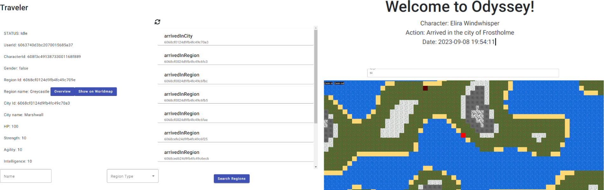






Ever since I had a course on web development in university I never stopped tinkering around with webdev projects, especially with the MEAN stack. As I am also a game developer, naturally I tried to combine both skills. The result is a web application named Odyssey, a project that falls somewhere in between a Multi-User Dungeon (MUD), a simulator, and an RPG (Role-Playing Game). While it's far from being a finished product, I'm committed to dedicating my free time to its ongoing development.

## Uniting Web Development and Gaming
Odyssey is not your typical web application. It represents a unique blend of the classic MUD experience, the immersive elements of a simulator, and the depth of a role-playing game. All these elements are woven together into a fantastical web-based world. In Odyssey, players can create multiple characters, each ready to embark on their own adventure. These characters traverse a procedurally generated landscape that consists of diverse regions and cities, where the possibilities for exploration and interaction are virtually limitless.

## Crafting a Procedural World
One of Odyssey's standout features is its procedurally generated map, a feature that truly sets it apart from conventional RPGs. To create this ever-changing landscape, I utilized a Simplex Noise algorithm. This algorithm generates heightmaps, assigning a value between 0.0 and 1.0 to every coordinate combination of X and Y. These values serve as the foundation for creating a random, dynamic world that evolves with each player's journey. These regions, shaped by these values, are the playgrounds for players to explore, each visit promising unique experiences.

## Under the Hood
Odyssey is split up into two projects. A backend which hosts all the game objects and handles the game logic and a frontend which calls the backend api and displays the game data accordingly.

### Odyssey Frontend
The frontend is powered by the Angular and Phaser.js. Angular provides the sturdy foundation for the application, while Phaser.js steps in to craft the world map. This combination of Angular and Phaser.js ensures that players enjoy a seamless and captivating user experience.



### Odyssey Backend
Behind the scenes, the backend relies on the express.js framework. It functions as a REST API, offering specific routes that expose every facet of the game world. This includes everything from the details of different regions and cities to the characteristics of the characters who inhabit this virtual realm. However, the backend isn't just about data; it also handles essential aspects like user authorization and authentication, ensuring that players' interactions with the game are secure and personalized.

#### Region Generation with Simplex Noise
One of the standout features of Odyssey is its procedurally generated map, which adds a dynamic and ever-changing aspect to the game world. This is achieved using a Simplex Noise algorithm to generate heightmaps over a set of systematically generated region coordinates. Here's a basic outline of the coordination generation process:

Before delving into the code, it's important to understand why there are two functions, spiralOut and spiralOutPerformance. These functions serve different purposes in the region generation process, and their utilization depends on specific factors.

**spiralOut**: This function is responsible for generating region coordinates in a spiral pattern. It initializes the x and y coordinates, along with the delta values that dictate the direction of movement. The algorithm calculates these coordinates iteratively and generates a spiral pattern. However, using this function for a large number of iterations can be computationally expensive, and the coordinates need to be recalculated from (0, 0) each time, which can be inefficient as the number of iterations increases.

**spiralOutPerformance**: To address the computational inefficiency mentioned above, the spiralOutPerformance function is introduced. It optimizes the process by utilizing the existing delta values. If the delta values are already instantiated from previous iterations, this function allows for a much more efficient calculation of the next coordinate. It avoids the need to start from (0, 0) and instead continues from the last calculated coordinate, significantly improving performance.

Now, let's proceed with the code:

```
export let x: number = 0;
export let y: number = 0;
export let delta: number[] | null = null;

export function setDeltaNull(): void {
  delta = null;
}

export function spiralOut(iterations: number): number[] {
  x = 0;
  y = 0;
  delta = [0, -1];

  for (let i: number = 0; i <= iterations; i++) {
    if (
      x === y ||
      (x < 0 && x === -y) ||
      (x > 0 && x === 1 - y)
    ) {
      // change direction
      delta = [-delta[1], delta[0]];
    }

    x += delta[0];
    y += delta[1];
  }
  x -= delta[0];
  y -= delta[1];

  return [x, y];
}

export function spiralOutPerformance(): number[] {
  if(delta) {
    x += delta[0]
    y += delta[1]
  }

  if (
    x === y ||
    (x < 0 && x === -y) ||
    (x > 0 && x === 1 - y)
  ) {
    // change direction
    if(delta) delta = [-delta[1], delta[0]];
  }

  return [x, y];
}
```

After the generation of the region coordinate, a noise value is assigned by using the coordinates as input to the noise algorithm. Simplex Noise then returns the heigth value as noise for the given coordinate. The value is then used for all sorts of procedural settings for the region (city generationm, biome type, ...). The combination of the spiral function and Simplex Noise ensures that regions are generated in a visually interesting and unique manner. This adds depth and variety to the game world, making each player's journey a distinct experience.

#### Pathfinding for Character Movement
To enable character movement and traversal of regions, the backend incorporates the A* pathfinding algorithm. The [PathFinding.js](https://github.com/qiao/PathFinding.js/) library is used for this purpose. Here's a breakdown of the pathfinding function:

```
import { RegionModel, Region } from '../components/regions/regionModel';
import PF from 'pathfinding';

export default function findPath(startRegion: Region, endRegion: Region, clearance: number): Promise<Region[] | void> {
  const promise = new Promise<Region[]>((resolve, reject) => {
    // Calculate Grid Borders
    const topLeftX = startRegion.x < endRegion.x ? startRegion.x : endRegion.x;
    const topLeftY = startRegion.y > endRegion.y ? startRegion.y : endRegion.y;

    const bottomRightX = startRegion.x > endRegion.x ? startRegion.x : endRegion.x;
    const bottomRightY = startRegion.y < endRegion.y ? startRegion.y : endRegion.y;

    // Fetch Regions
    RegionModel.find({
      x: { $gte: topLeftX - clearance, $lte: bottomRightX + clearance },
      y: { $gte: bottomRightY - clearance, $lte: topLeftY + clearance }
    }, 'x y type', { sort: { y: 1, x: 1 } })
      .then(regions => {
        // Generate Search Matrix
        const griddMatrix: Region[][] = [];
        let pointerYWorld = regions[0].y;
        let row: Region[] = [];
        regions.forEach(region => {
          if (pointerYWorld !== region.y) {
            griddMatrix.push(row);
            row = [];
          }
          row.push(region);
          pointerYWorld = region.y;
        });
        griddMatrix.push(row);

        // Find our Start and Endpoint in the gridmatrix
        const startRegionY = griddMatrix.findIndex(s => s.some(o => o._id.toString() === startRegion._id.toString()));
        const startRegionX = griddMatrix[startRegionY].findIndex(s => s._id.toString() === startRegion._id.toString());
        const endRegionY = griddMatrix.findIndex(s => s.some(o => o._id.toString() === endRegion._id.toString()));
        const endRegionX = griddMatrix[endRegionY].findIndex(s => s._id.toString() === endRegion._id.toString());

        // Generate a binary matrix to define walkable tiles
        const binaryMatrix = griddMatrix.map(x => x.map(r => r.type !== 'water' ? 0 : 1));

        // A* Path Searching
        const grid = new PF.Grid(binaryMatrix);
        const finder = new PF.AStarFinder();
        const path = finder.findPath(
          startRegionX,
          startRegionY,
          endRegionX,
          endRegionY,
          grid
        );

        // This is the way
        const stations: Region[] = [];
        path.forEach(coordinate => {
          stations.push(griddMatrix[coordinate[1]][coordinate[0]]);
        });
        return resolve(stations);
        });
      })
      .catch(err => {
        console.log(err)
      })
      
  return promise;
}
```

This pathfinding function calculates a path from a starting region to an endpoint, considering clearance and region obstacles. It leverages A* pathfinding to determine the most efficient route for character movement.

In conclusion, the Odyssey Backend plays a vital role in managing the game world, generating regions with Simplex Noise, and enabling characters to navigate and explore the virtual world. It showcases the integration of web development and gaming to provide a unique and engaging user experience.

## Embark on Your Odyssey
If you're curious to experience this enchanting project firsthand, don't hesitate to [start your Odyssey now](https://odyssey.daviddiener.de). Keep in mind that Odyssey is an ongoing work in progress, and keeps evolving and expanding. It's a testament to the endless possibilities that emerge when web development and gaming unite, offering players a glimpse into a unique and captivating web-based realm.