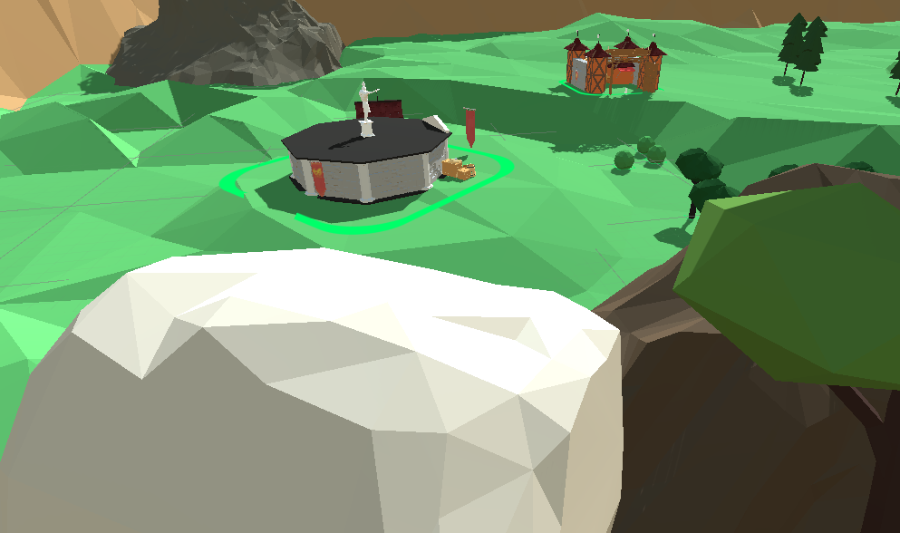
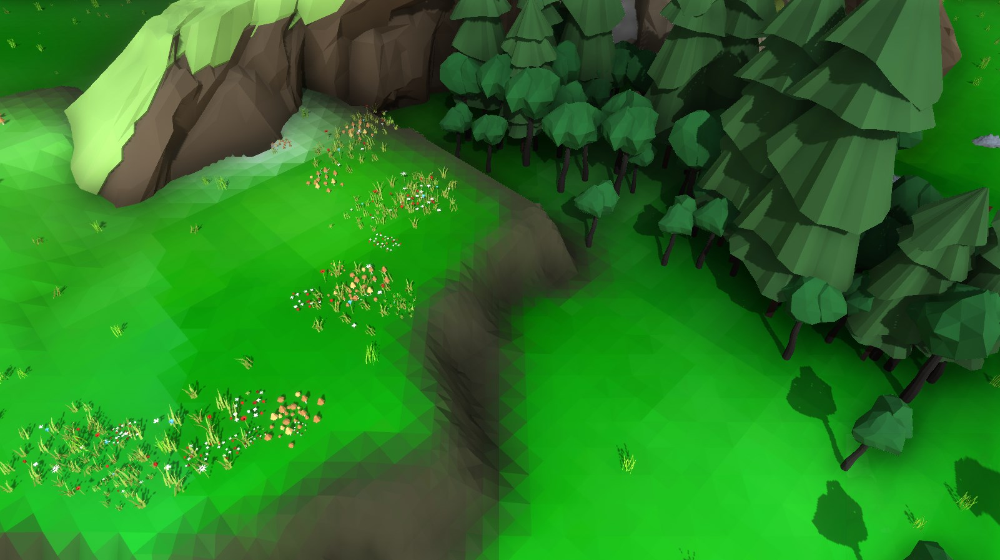
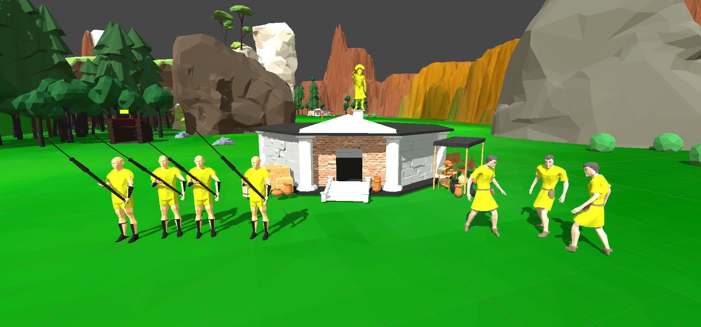
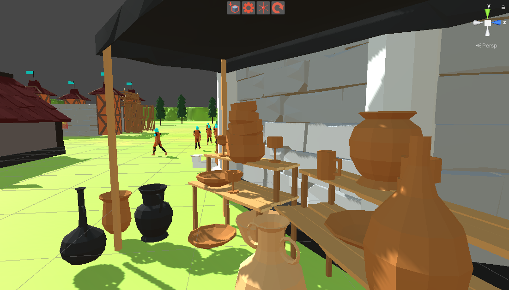

**Status: Abandoned**

Ladies and gentlemen, let me tell you about my epic masterpiece, Son of Olympus. It's a real-time strategy game based on Greek mythology, so of course there was some kind of inspiration from on of my favorite RTS games Age Of Mythology.

I owe a lot of the credit to the [RTS Engine](https://gamedevspice.com/assets/rts-engine/) asset, which saved me countless hours of coding. Instead, I was able to focus on the fun part – designing the game and creating content.

Here are some pictures of what the game currently looks like:

**Landscape showing a town center and barracks**

**Landscape with some details**

**Spearman (left) and Servant (right) in front of the town center**

**Details on the town center**
