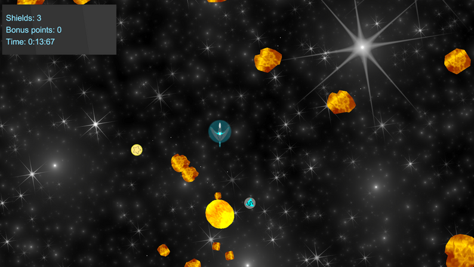

I recently participated in Ludum Dare 50, a 48-hour game jam where participants create a game based on a randomly selected theme. The theme for this year's jam was "Delay the inevitable."

I decided to create an arcade space game called Vortex, where the player must survive as long as possible while an increasing number of meteors are being pulled to them by the sun's gravitation. The game is developed with Unity, using C#.

The game features a self-hosted leaderboard which I host on Render.com. The leaderboard includes a backend server and a MongoDB database to persist the scores. The Vortex frontend then submits the scores over a REST API. The backend server is written in TypeScript using the Express.js library.

I also used Unity's shader graph language to make a highly efficient background effect with fading stars for the game.

The game was a lot of fun to develop, and I'm happy with how it turned out. I hope you enjoy playing it!



**Here are some screenshots of the game:**





**Thanks for reading!**